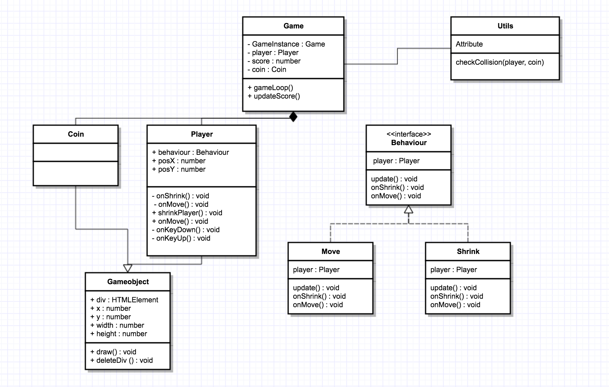

# Installatie game Wilco van Dijk
De Assesor kan een fork maken van deze repository. Vervolgens kan je deze clonen in je htdocs folder. Open de game via localhost:8888/prg08_game_wilcovandijk_0908405

# Interface
Behaviour.ts heeft een interface met daarin de property: 'player' en de methods: update(), onShrink(), onMove().

# Static utility method
Utils.ts heeft een public static functie die checkt of de 2 objecten elkaar raken. Geeft true terug als het waar is, anders false.

# Singleton
In main.ts heb je de getInstance method. Die kan je uitvoeren. Deze checkt of er al een instance is aangemaakt van game, zo niet wordt deze aangemaakt. vervolgens krijg je de gameinstance terug.

# Strategy
Er is een behaviour interface. shrink.ts en move.ts implementeren deze interface. Dit betekent dat de properties en methods die in de interface zijn aangegeven in deze classes moeten staan. Bij het aanmaken van een player wordt de behaviour gezet op move. Wanneer je op spatie klikt wordt deze property overgeschreven door shrink. Je geeft iedere keer de player mee waardoor je de behaviour kan overschrijven.

# Encapsulation, Composition, Inheritance
In game.ts zijn alle properties private. In player.ts zijn properties zoals speed etc  private gemaakt. Dit hoeft alleen player te weten. player.ts en coin.ts extenden allebei van gameobject. In behaviour.ts staat aangegeven welke properties en methods de classes move en shrink moeten hebben.

Peer review: Tom Vrijmoet

In Game.ts staan 2 private variabelen, coinHeight en coinWidth. Deze variabelen vul je vervolgens hard coded en worden daarna doorgegeven bij coin = new Coin.
Dit kan sneller door bijvoorbeeld de vaste waarde er meteen aan te hangen bij het declareren. Deze declaratie zou ook beter passen in coin.ts.

In player.ts zitten nog alle move functionaliteiten. Deze functionaliteiten zouden goed in een behaviour kunnen. Dit zal voor een stuk schonere code zorgen.
Nu staan er nog veel if statements en moeilijk te begrijpen code. Dit kan allemaal worden weggehaald zodra je de behaviours in orde maakt.
Je zou dan alleen nog maar de this.behaviour.update() nodig hebben in Move().

De functie shrinkplayer staat nu in Game.ts, deze functie zou ook prima in Shrinking.ts kunnen staan. Dit zou beter staan hier. 
Het is een logischere plek om neer te zetten, en ook dit zal game.ts weer wat opschonen.

Je interface (behaviour.ts) heeft ook nog een onMove() functie die verder nergens wordt aangeroepen. Niet dat dit veel schade kan doen maar het zou wel netter zijn als deze niet bestond.

De rest ziet er aardig duidelijk uit.

<h1> Peer review: Lennart van Welzen <h1>

wejo gekke game
